# Exploratory_Data_Analysis_Retail
Exploratory Data Analysis (EDA) on Sample Superstore Dataset by visualizing data through plots and dashboards.

<b>Aim :</b> Perform 'Exploratory Data Analysis' on dataset 'SampleSuperstore'. As a business manager, try to find out the weak areas where you can work to
make more profit. What all business problems you can derive by exploring the data? 

<b>Dataset :</b> Data can be found at https://bit.ly/3i4rbWl

## Exploratory Data Analysis
Exploratory Data Analysis (EDA) refers to the critical process of performing initial investigations on data so as to discover patterns,to spot anomalies,to test hypothesis and to check assumptions with the help of summary statistics and graphical representations.

## Libraries
NumPy to perform the multi-dimensional operation.

Pandas is a fast, powerful, flexible and easy to use open source data analysis and manipulation tool.

Seaborn and Matplotlib used for plotting and vizualization of data.

Scikit is used for pre-processing with LabelEncoder, K-means clustering, model evaluation and confusion matrix.

Scipy computes the distance between each pair of the two collections of inputs.

```
# Importing all the important Libraries
import pandas as pd
import seaborn as sns
import matplotlib.pyplot as plt
%matplotlib inline
```

## Loading Dataset
The dataset is available at https://bit.ly/3i4rbWl

The SampleSuperstore dataset consists of 9994 records with 13 columns as 'Ship Mode', 'Segment', 'Country', 'City', 'State', 'Postal Code', 'Region', 'Category', 'Sub-Category', 'Sales', 'Quantity', 'Discount' and 'Profit'.

```
# Loading Dataset
df = pd.read_csv('SampleSuperstore.csv')
print('Shape:', df.shape)
```

```
# Sample Dataset
df.head()

# Dataset Columns
df.columns

# Check Missing and Null Values
print(df.isnull().sum())
print("Total number of null values =", df.isnull().sum().sum())

# Dataset Types
df.dtypes

# Dataset Sumamry
df.info()

# Dataset Statistical Description
df.describe()
```

## Visualizing Data
<b>Pie chart :</b> Pie Chart is a circular statistical plot that can display only one series of data. The area of the chart is the total percentage of the given data. The area of slices of the pie represents the percentage of the parts of the data.

<b>PairPlot :</b> Pair plot makes high-level scatter plots to capture relationships between multiple variables within a dataframe. It help us to understand the relationship between various independent features

<b>Heatmap :</b> Heat map is used to find out the correlation between different features in the dataset. High positive or negative value shows that the features have high correlation.

## Correlation Analysis
Pandas dataframe.corr() is used to find the pairwise correlation of all columns in the dataframe. Both NA and null values are automatically excluded. For any non-numeric data type columns in the dataframe it is ignored.

```
# Correlation Analysis
corr_mat = df.corr()
corr_mat
```
```
plt.figure(figsize=(7,6))
sns.heatmap(corr_mat, annot=True)
plt.title('Correlation Analysis')
plt.savefig('correlation.png')
plt.show()
```
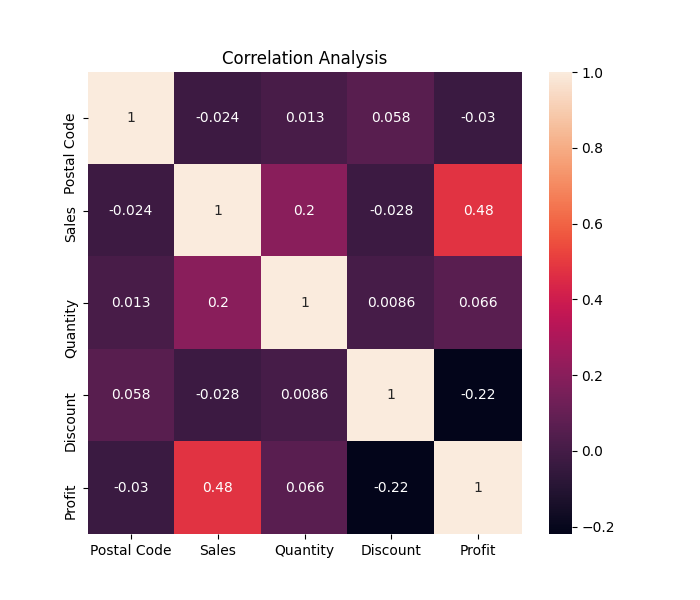

## Covariance
Pandas dataframe.cov() is used to compute the pairwise covariance among the series of a DataFrame. The returned data frame is the covariance matrix of the columns of the DataFrame.

Both NA and null values are automatically excluded from the calculation. A threshold can be set for the minimum number of observations for each value created. Comparisons with observations below this threshold will be returned as NaN.

```
# Covariance Analysis
cov_mat = df.cov()
cov_mat
```
```
fig,axes = plt.subplots(1,1,figsize=(9,6))
sns.heatmap(cov_mat, annot= True)
plt.title('Covariance')
plt.savefig('covariance.png')
plt.show()
```
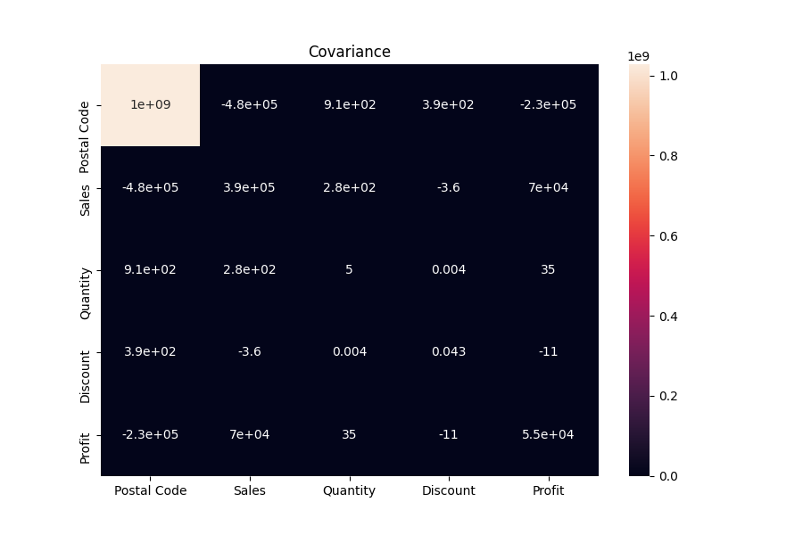

```
# Unique items in attributes
print('Category:', df['Category'].unique())
print('Segment:', df['Segment'].unique())
print('Ship Mode:', df['Ship Mode'].unique())
```
```
sns.countplot(x=df['Category'])
plt.title('Category Unique Items')
plt.savefig('categoryUnique.png')
```
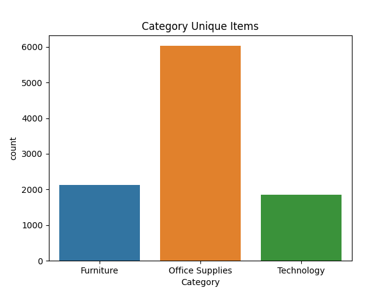
```
sns.countplot(x=df['Segment'])
plt.title('Segment Unique Items')
plt.savefig('segmentUnique.png')
```
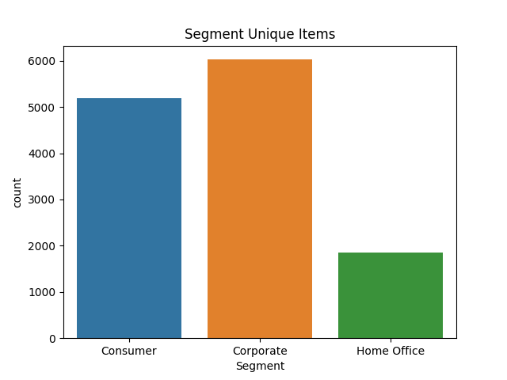
```
sns.countplot(x=df['Ship Mode'])
plt.title('Ship Mode Unique Items')
plt.savefig('shipmodeUnique.png')
```
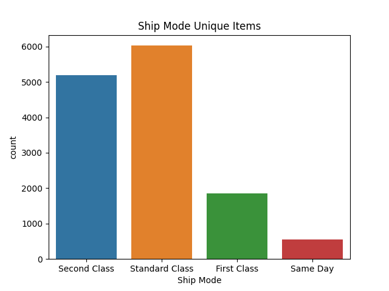

## Cleaning Data
Data cleaning is the process of detecting and correcting (or removing) corrupt or inaccurate records from a record set, table, or database and refers to identifying incomplete, incorrect, inaccurate or irrelevant parts of the data and then replacing, modifying, or deleting the dirty or coarse data.

```
# Checking null
df.isnull().sum()

# Removing Duplicates
print('Total Duplicates:', df.duplicated().sum())
df.drop_duplicates()

df['Country'].value_counts()
```
Clearly the data is for US country only, so we can drop the 'Country' column as we dont need any analysis to be done based on it.

```
# Dropping Country column
df=df.drop('Country',axis=1)
df.head()
```

## Removing Outliers
In statistics, an outlier is an observation point that is distant from other observations.

### Discover outliers with mathematical function
The Z-score is the signed number of standard deviations by which the value of an observation or data point is above the mean value of what is being observed or measured.

<b>z = x - mean / std</b><br>
where,<br>
z = standard score<br>
x = observed value<br>
mean = mean of the sample<br>
std = standard deviation of the sample

The intuition behind Z-score is to describe any data point by finding their relationship with the Standard Deviation and Mean of the group of data points. Z-score is finding the distribution of data where mean is 0 and standard deviation is 1 i.e. normal distribution.

While calculating the Z-score we re-scale and center the data and look for data points which are too far from zero. These data points which are way too far from zero will be treated as the outliers. In most of the cases a threshold of 3 or -3 is used i.e if the Z-score value is greater than or less than 3 or -3 respectively, that data point will be identified as outliers.
```
# Calculating Z-score
sorted_data = df.sort_values(by='Sales', ascending = False)
sorted_data['Z-Score'] = (sorted_data.Sales - sorted_data.Sales.mean()) / sorted_data.Sales.std()
sorted_data.head()
```
```
# Z-score Scatterplot
fig, ax = plt.subplots(figsize=(16,8))
ax.scatter(sorted_data['Sales'], sorted_data['Z-Score'])
plt.title('Z-Score Scatterplot')
plt.savefig('zscore.png')
plt.show()
```
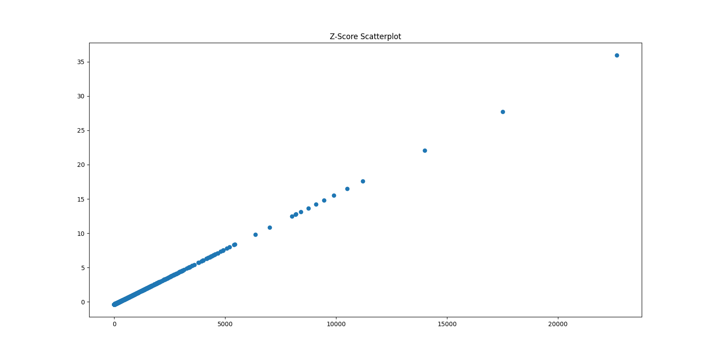
Looking at the plot above, we can most of data points are lying bottom left side but there are points which are far from the population like top right corner.

```
# Z-score threshold=3
sorted_data = sorted_data[sorted_data['Z-Score']<3]
sorted_data.head(10)

new_df = sorted_data
new_df.shape
```

## Data Visualizations and Analysis
```
# Drop columns Z-score and Postal Code
new_df = new_df.drop(['Z-Score','Postal Code'],axis=1)
```

```
plt.figure(figsize=(16,8))
sns.countplot(x='State',data=new_df, palette="rocket")
plt.xticks(rotation=90)
plt.title('State wise count')
plt.savefig('stateCount.png')
plt.show()
```
`
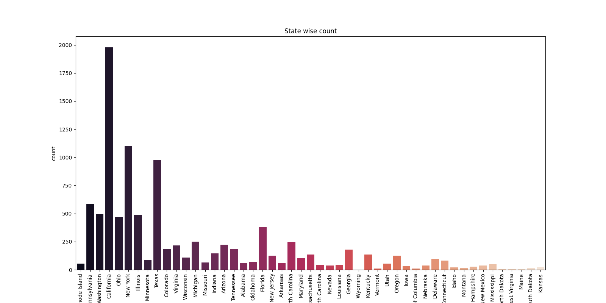

## Product Level Analysis
```
# Product Level Analysis
new_df['Category'].unique()

# Number of products in each category 
new_df['Category'].value_counts()
```

```
# Number of Sub-categories products are divided.
print('Number of Sub-categories products:',new_df['Sub-Category'].nunique())
# Number of products in each sub-category
new_df['Sub-Category'].value_counts()
```

```
# Sub-categories w.r.t. Categories
plt.figure(figsize=(16,8))
sns.countplot(x=new_df['Sub-Category'], palette="rocket")
plt.title('Sub-category count')
plt.savefig('subCategoryCount.png')
plt.show()
```
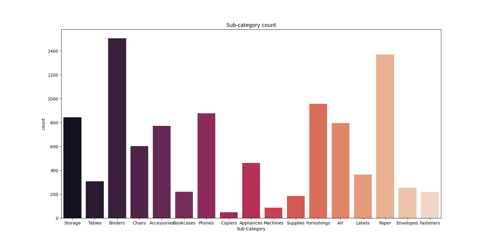

```
plt.figure(figsize=(10,10))
new_df['Sub-Category'].value_counts().plot.pie(autopct="%1.1f%%")
plt.title('Sub-category Pie-chart')
plt.savefig('subCategoryPiechart.png')
plt.show()
```
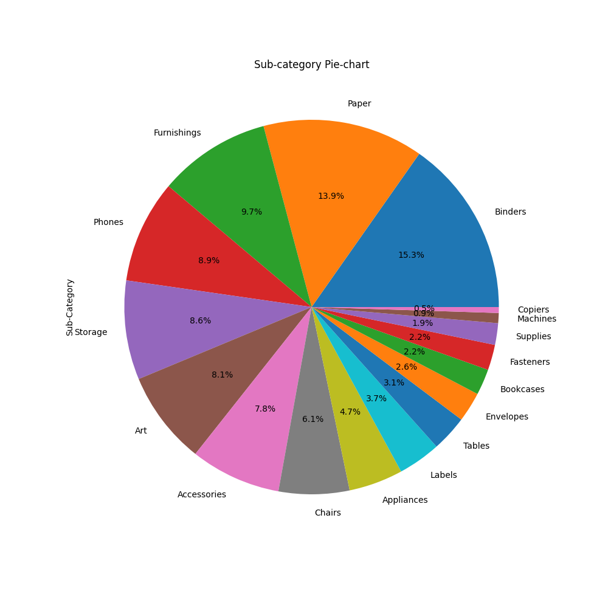

```
new_df.groupby('Sub-Category')[['Profit','Sales']].agg(['sum']).plot.bar()
plt.title('Total Profit and Sales per Sub-Category')
plt.savefig('profitSubCategory.png')
plt.show()
```
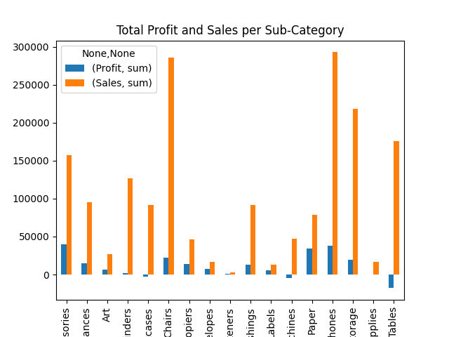

```
# Count of Sub-Category region wise
plt.figure(figsize=(16,8))
sns.countplot(x="Sub-Category", hue="Region", data=new_df, palette="rocket")
plt.title('Count of Sub-Category Region wise in United States')
plt.savefig('subCategoryRegion-wise.png')
plt.show()
```
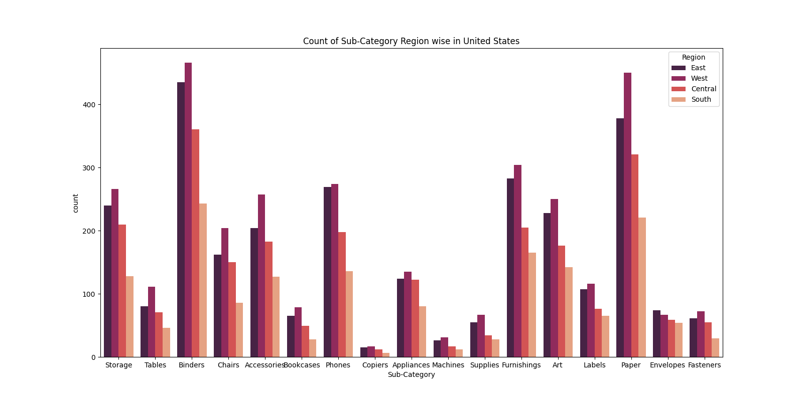

```
new_df['Cost'] = new_df['Sales'] - new_df['Profit']
new_df['Profit %'] = (new_df['Profit'] / new_df['Cost']) * 100
new_df[['City','State','Category','Sub-Category','Sales','Profit','Cost','Profit %']].head()
```

```
figsize=(15,10)
sns.pairplot(new_df, hue='Sub-Category')
plt.title('Sub-category Pairplot')
plt.savefig('subCategoryPairplot.png')
```
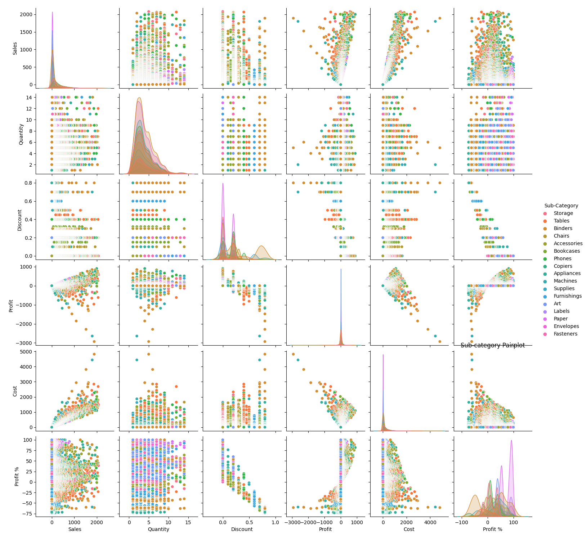

## Segment Level Analysis
```
# Segment Level Analysis
new_df['Segment'].value_counts()
```

```
# Total Profit and Sales per Segment
new_df.groupby('Segment')[['Profit','Sales']].agg(['sum']).plot.bar()
plt.title('Total Profit and Sales per Segment')
plt.savefig('profitSegment.png')
plt.show()
```
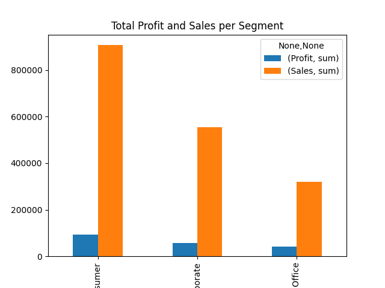

```
# Count of Segment region wise
plt.figure(figsize=(16,8))
sns.countplot(x="Segment", hue="Region", data=new_df, palette="rocket")
plt.title('Count of Segments Region wise in United States')
plt.savefig('segmentRegion-wise.png')
plt.show()
```
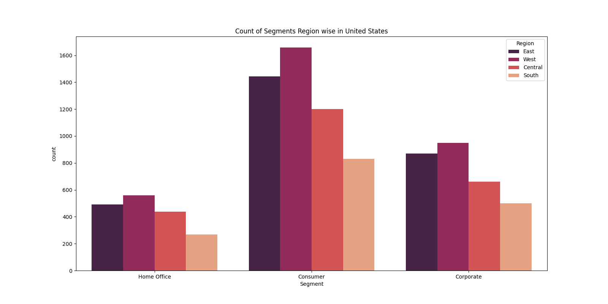

```
figsize=(15,10)
sns.pairplot(new_df, hue='Segment')
plt.title('Segment Pairplot')
plt.savefig('segmentPairplot.png')
```
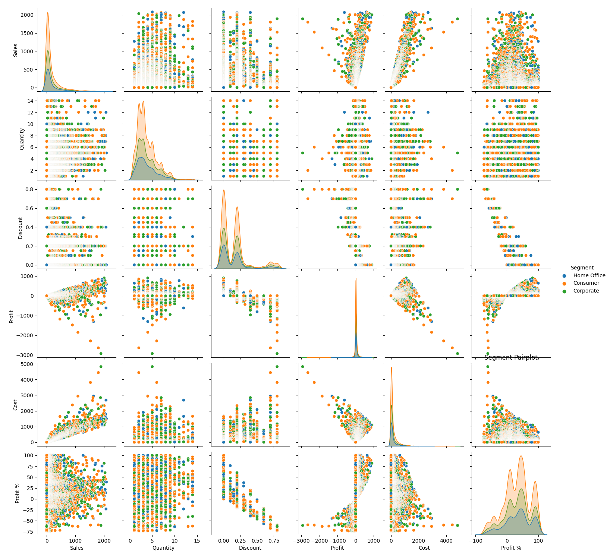

## Ship Mode Level Analysis
```
# Ship Mode Level Analysis
new_df['Ship Mode'].value_counts()
```

```
# Total Profit and Sales per Ship Mode
new_df.groupby('Ship Mode')[['Profit','Sales']].agg(['sum']).plot.bar()
plt.title('Total Profit and Sales per Ship Mode')
plt.savefig('profitShipMode.png')
plt.show()
```
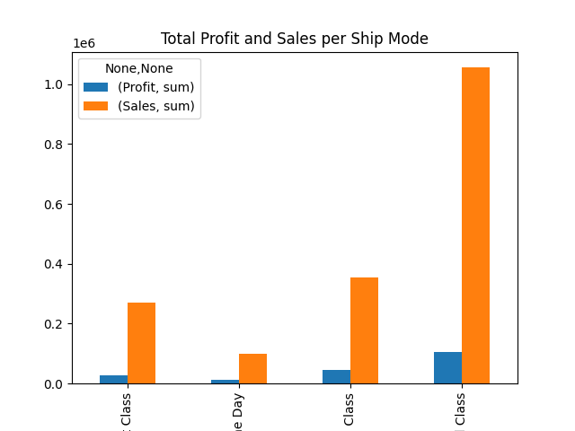

```
figsize=(15,10)
sns.pairplot(new_df, hue='Ship Mode')
plt.title('Ship Mode Pairplot')
plt.savefig('shipModePairplot.png')
```
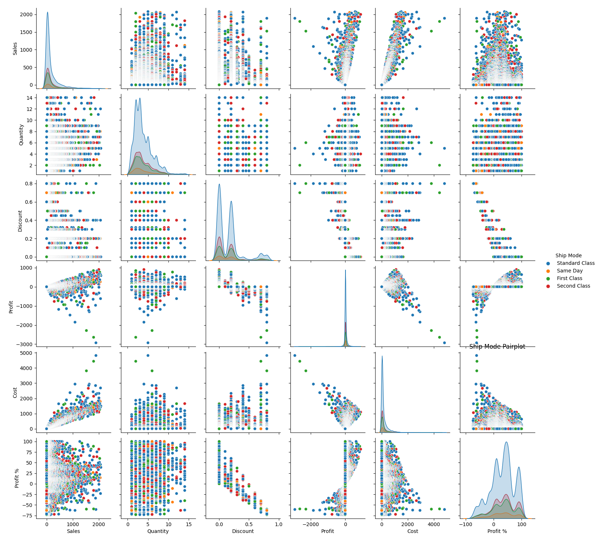

```
# Relation between Ship Mode and Segment
plt.figure(figsize=(16,8))
sns.catplot(x="Ship Mode", data=new_df, hue="Segment",kind="count",palette="rocket")
plt.title('Relation between Ship Mode and Segment')
plt.savefig('shipModeandSegment.png')
plt.show()
```
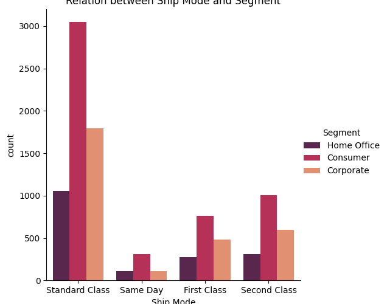

## Top 10 Profit and Sales Analysis
```
# Region wise Profit and Sales
data_top_10_region = new_df.groupby("Region")[["Profit", "Sales"]].sum().reset_index().sort_values(by="Profit",ascending=False)
data_top_10_region.head(10)
```

```
# Top 10 State wise Profit and Sales
data_top_10_states = new_df.groupby("State")[["Profit", "Sales"]].sum().reset_index().sort_values(by="Profit",ascending=False)
data_top_10_states.head(10)
```

```
# Top 10 City wise Profit and Sales
data_top_10_cities = new_df.groupby("City")[["Profit", "Sales"]].sum().reset_index().sort_values(by="Profit",ascending=False)
data_top_10_cities.head(10)
```

```
# Top 10 Sub-category wise Profit and Sales
data_top_10_sub_categories = new_df.groupby("Sub-Category")[["Profit", "Sales"]].sum().reset_index().sort_values(by="Profit",ascending=False)
data_top_10_sub_categories.head(10)
```


# Creating Dashboards
Dash is an open source framework created by the plotly team that leverages Flask, plotly.js and React.js to build custom data visualization apps. This article is a high level overview of how to get started with dash to build a simple, yet powerful interactive dashboard.


Create dashboard.py or use Google Colab. In this project, dashboard.py is used to run the dashboard on local server.

```
import dash
import dash_bootstrap_components as dbc
import dash_core_components as dcc
import dash_html_components as html
import dash_table
import pandas as pd
import plotly.graph_objects as go
from dash.dependencies import Input, Output

PLOTLY_LOGO = "https://images.plot.ly/logo/new-branding/plotly-logomark.png"
app = dash.Dash(external_stylesheets=[dbc.themes.BOOTSTRAP],
                title='Superstore Exploratory Data Analysis',
                update_title='Loading...')
df = pd.read_csv('SampleSuperstore.csv')
df = df.drop(['Country'], axis=1)

sorted_data = df.sort_values(by='Sales', ascending=False)
sorted_data['Z-Score'] = (sorted_data.Sales - sorted_data.Sales.mean()) / sorted_data.Sales.std()
sorted_data = sorted_data[sorted_data['Z-Score'] < 3]
new_df = sorted_data

# Region wise Profit and Sales
data_top_10_region = new_df.groupby("Region")[["Profit", "Sales"]].sum().reset_index().sort_values(by="Profit",
                                                                                                   ascending=False)
# Top 10 State wise Profit and Sales
data_top_10_states = new_df.groupby("State")[["Profit", "Sales"]].sum().reset_index().sort_values(by="Profit",
                                                                                                  ascending=False)
# Top 10 City wise Profit and Sales
data_top_10_cities = new_df.groupby("City")[["Profit", "Sales"]].sum().reset_index().sort_values(by="Profit",
                                                                                                 ascending=False)
# Top 10 Sub-category wise Profit and Sales
data_top_10_sub_categories = new_df.groupby("Sub-Category")[["Profit", "Sales"]].sum().reset_index().sort_values(
    by="Profit", ascending=False)

# Navbar Search
search_bar = dbc.Row(
    [
        dbc.Col(dbc.Input(type="search", placeholder="Search")),
        dbc.Col(
            dbc.Button("Search", color="primary", className="ml-2"),
            width="auto"
        ),
        dbc.Col(
            dbc.Button("Aditya Kataria", color="light", className="ml-5"),
        )
    ],
    no_gutters=True,
    className="ml-auto flex-nowrap mt-3 mt-md-0",
    align="center",
)

# Navbar
navbar = dbc.Navbar(
    [
        html.A(
            dbc.Row(
                [
                    dbc.Col(html.Img(src=PLOTLY_LOGO, height="40px"), width="40px"),
                    dbc.Col(dbc.NavbarBrand("Plotly Dash | Exploratory Data Analysis"), className="ml-2"),
                ],
                align="center",
                no_gutters=True,
            ),
            href="https://plot.ly",
        ),
        dbc.NavbarToggler(id="navbar-toggler"),
        dbc.Collapse(search_bar, id="navbar-collapse", navbar=True),
    ],
    color="dark",
    sticky="top",
    dark=True,
)

# Sidebar
SIDEBAR_STYLE = {
    "position": "fixed",
    "top": "4rem",
    "left": 0,
    "bottom": 0,
    "width": "16rem",
    "padding": "2rem 1rem",
    "background-color": "#f8f9fa",
}

# Main Window
# the styles for the main content position it to the right of the sidebar and
# add some padding.
CONTENT_STYLE = {
    "margin-left": "18rem",
    "margin-right": "2rem",
    "padding": "2rem 1rem",
}

sidebar = html.Div(
    [
        html.H2("Superstore", className="display-5"),
        html.Hr(),
        html.P(
            "Dashboard", className="lead"
        ),
        dbc.Nav(
            [
                dbc.NavLink("Dataset", href="/dataset", id="page-2-link"),
                dbc.NavLink("Correlation Analysis", href="/corr", id="page-3-link"),
                dbc.NavLink("Covariance", href="/cov", id="page-4-link"),
                dbc.NavLink("Product Level Analysis", href="/product_level_analysis", id="page-5-link"),
                dbc.NavLink("Segment Analysis", href="/segment_analysis", id="page-6-link"),
                dbc.NavLink("Ship Mode Analysis", href="/ship_mode_analysis", id="page-7-link"),
                dbc.NavLink("Top 10", href="/top_10", id="page-8-link"),
            ],
            vertical=True,
            pills=True,
        ),
        html.Hr(),
        html.Br(),
        html.P(["Developed with ❤️ in India"], className="text-center")
    ],
    style=SIDEBAR_STYLE,
)

content = html.Div(id="page-content", style=CONTENT_STYLE)
app.layout = html.Div([navbar, dcc.Location(id="url"), sidebar, content])


@app.callback(
    [Output(f"page-{i}-link", "active") for i in range(1, 9)],
    [Input("url", "pathname")],
)
def toggle_active_links(pathname):
    if pathname == "/":
        # Treat page 1 as the homepage / index
        return True, False, False, False, False
    return [pathname == f"/page-{i}" for i in range(1, 9)]


@app.callback(
    Output("page-content", "children"),
    [Input("url", "pathname")]
)
def render_page_content(pathname):
    if pathname == "/":
        return html.Div([html.H3("Welcome to Superstore Dashboard"),
                         html.Img(src='/assets/img/img2.jpg', height="300px"),
                         html.Div([html.H4("Exploratory Data Analysis"),
                                   html.P("Exploratory Data Analysis (EDA) refers to the critical process of "
                                          "performing initial investigations on data so as to discover patterns,"
                                          "to spot anomalies,to test hypothesis and to check assumptions with the "
                                          "help of summary statistics and graphical representations."),
                                   ]),
                         ])
    elif pathname == "/dataset":
        return html.Div([html.H4("Sample Superstore Dataset"),
                         html.P([
                             "The dataset is available ",
                             html.A("here", href="https://bit.ly/3i4rbWl", target="_blank"),
                             html.P(
                                 "The SampleSuperstore dataset "
                                 "consists of 9994 records with 13 columns as 'Ship Mode', 'Segment', 'Country', "
                                 "'City', 'State', 'Postal Code', 'Region', 'Category', 'Sub-Category', 'Sales', "
                                 "'Quantity', 'Discount' and 'Profit'.")
                         ]),
                         dash_table.DataTable(
                             id='table',
                             columns=[{"name": i, "id": i} for i in df.columns],
                             data=df.to_dict('records'),
                         )])
    elif pathname == "/corr":
        return html.Div([html.H4("Correlation Analysis"),
                         html.P("Pandas dataframe.corr() is used to find the pairwise correlation of all columns in "
                                "the dataframe. Both NA and null values are automatically excluded. For any "
                                "non-numeric data type columns in the dataframe it is ignored."),
                         dash_table.DataTable(
                             id='table',
                             columns=[{"name": i, "id": i} for i in df.corr()],
                             data=df.corr().to_dict('records'),
                         ),
                         dcc.Graph(
                             id='heatmap',
                             figure={
                                 'data': [go.Heatmap(
                                     z=df.corr().values,
                                     x=df.corr().columns.values,
                                     y=df.corr().columns.values,
                                     colorscale='RdBu'
                                 )],
                                 'layout': go.Layout(
                                     title="Correlation Heatmap",
                                     xaxis=dict(ticks='', nticks=36),
                                     yaxis=dict(ticks=''),
                                     width=600, height=500,
                                 ),
                             }
                         )
                         ])
    elif pathname == "/cov":
        return html.Div([html.H4("Covariance"),
                         html.P("Pandas dataframe.cov() is used to compute the pairwise covariance among the series "
                                "of a DataFrame. The returned data frame is the covariance matrix of the columns of "
                                "the DataFrame.Both NA and null values are automatically excluded from the "
                                "calculation. A threshold can be set for the minimum number of observations for each "
                                "value created. Comparisons with observations below this threshold will be returned "
                                "as NaN."),
                         dash_table.DataTable(
                             id='table',
                             columns=[{"name": i, "id": i} for i in df.cov()],
                             data=df.cov().to_dict('records'),
                         ),
                         dcc.Graph(
                             id='heatmap',
                             figure={
                                 'data': [go.Heatmap(
                                     z=df.cov().values,
                                     x=df.cov().columns.values,
                                     y=df.cov().columns.values,
                                     colorscale='RdBu'
                                 )],
                                 'layout': go.Layout(
                                     title="Covariance Heatmap",
                                     xaxis=dict(ticks='', nticks=36),
                                     yaxis=dict(ticks=''),
                                     width=600, height=500,
                                 ),
                             }
                         )
                         ])
    elif pathname == "/product_level_analysis":
        return html.Div([html.H4("Product Level Analysis"),
                         dbc.Row(
                             [
                                 dbc.Col(dcc.Graph(
                                     id='bar',
                                     figure={
                                         'data': [go.Bar(
                                             x=new_df['Category'].value_counts().index.values,
                                             y=new_df['Category'].value_counts().values,

                                         )],
                                         'layout': go.Layout(
                                             title="Category Unique Items",
                                             xaxis=dict(ticks=''),
                                             yaxis=dict(ticks=''),
                                             width=500, height=500,
                                         ),
                                     }
                                 )),
                                 dbc.Col(dcc.Graph(
                                     id='bar',
                                     figure={
                                         'data': [go.Bar(
                                             x=new_df['Sub-Category'].value_counts().index.values,
                                             y=new_df['Sub-Category'].value_counts().values,

                                         )],
                                         'layout': go.Layout(
                                             title="Sub-Category Unique Items",
                                             xaxis=dict(ticks=''),
                                             yaxis=dict(ticks=''),
                                             width=500, height=500,
                                         ),
                                     }
                                 )),
                             ]
                         ),
                         dbc.Row(
                             [
                                 dbc.Col(dcc.Graph(
                                     id='bar',
                                     figure={
                                         'data': [go.Pie(
                                             labels=new_df['Sub-Category'].value_counts().index.values,
                                             values=new_df['Sub-Category'].value_counts().values)],
                                         'layout': go.Layout(
                                             title="Sub-Category Distribution Pie chart",
                                             xaxis=dict(ticks=''),
                                             yaxis=dict(ticks=''),
                                             width=600, height=600,
                                         ),
                                     }
                                 )),
                             ], ),
                         dbc.Row(
                             dbc.Col(dcc.Graph(
                                 id='bar',
                                 figure={
                                     'data': [go.Bar(
                                         x=new_df['Sub-Category'],
                                         y=new_df[new_df['Region'] == 'East'].value_counts().values,
                                         name="East"
                                     ), go.Bar(
                                         x=new_df['Sub-Category'],
                                         y=new_df[new_df['Region'] == 'West'].value_counts().values,
                                         name="West"
                                     ), go.Bar(
                                         x=new_df['Sub-Category'],
                                         y=new_df[new_df['Region'] == 'Central'].value_counts().values,
                                         name="Central"
                                     ), go.Bar(
                                         x=new_df['Sub-Category'],
                                         y=new_df[new_df['Region'] == 'South'].value_counts().values,
                                         name="South"
                                     )],
                                     'layout': go.Layout(
                                         title="Count of Sub-Category region wise",
                                         xaxis=dict(ticks=''),
                                         yaxis=dict(ticks=''),
                                         width=900, height=600,
                                         barmode="group"
                                     ),
                                 }
                             )),
                         ),
                         ])
    elif pathname == "/segment_analysis":
        return html.Div([html.H4("Segment Analysis"),
                         dbc.Row(
                             [
                                 dbc.Col(dcc.Graph(
                                     id='bar',
                                     figure={
                                         'data': [go.Bar(
                                             x=new_df['Segment'].value_counts().index.values,
                                             y=new_df['Segment'].value_counts().values,

                                         )],
                                         'layout': go.Layout(
                                             title="Segment Unique Items",
                                             xaxis=dict(ticks=''),
                                             yaxis=dict(ticks=''),
                                             width=500, height=500,
                                         ),
                                     }
                                 )),
                                 dbc.Col(dcc.Graph(
                                     id='bar',
                                     figure={
                                         'data': [go.Pie(
                                             labels=new_df['Segment'].value_counts().index.values,
                                             values=new_df['Segment'].value_counts().values)],
                                         'layout': go.Layout(
                                             title="Segment Distribution Pie chart",
                                             xaxis=dict(ticks=''),
                                             yaxis=dict(ticks=''),
                                             width=500, height=500,
                                         ),
                                     }
                                 )),
                             ]
                         ),
                         dbc.Row(
                             dbc.Col(dcc.Graph(
                                 id='bar',
                                 figure={
                                     'data': [go.Bar(
                                         x=new_df['Segment'],
                                         y=new_df[new_df['Region'] == 'East'].value_counts().values,
                                         name="East"
                                     ), go.Bar(
                                         x=new_df['Segment'],
                                         y=new_df[new_df['Region'] == 'West'].value_counts().values,
                                         name="West"
                                     ), go.Bar(
                                         x=new_df['Segment'],
                                         y=new_df[new_df['Region'] == 'Central'].value_counts().values,
                                         name="Central"
                                     ), go.Bar(
                                         x=new_df['Segment'],
                                         y=new_df[new_df['Region'] == 'South'].value_counts().values,
                                         name="South"
                                     )],
                                     'layout': go.Layout(
                                         title="Count of Segments region wise",
                                         xaxis=dict(ticks=''),
                                         yaxis=dict(ticks=''),
                                         width=900, height=600,
                                         barmode="group"
                                     ),
                                 }
                             )),
                         ),
                         ])
    elif pathname == "/ship_mode_analysis":
        return html.Div([html.H4("Ship Mode Analysis"),
                         dbc.Row(
                             [
                                 dbc.Col(dcc.Graph(
                                     id='bar',
                                     figure={
                                         'data': [go.Bar(
                                             x=new_df['Ship Mode'].value_counts().index.values,
                                             y=new_df['Ship Mode'].value_counts().values,

                                         )],
                                         'layout': go.Layout(
                                             title="Ship Mode Unique Items",
                                             xaxis=dict(ticks=''),
                                             yaxis=dict(ticks=''),
                                             width=500, height=500,
                                         ),
                                     }
                                 )),
                                 dbc.Col(dcc.Graph(
                                     id='bar',
                                     figure={
                                         'data': [go.Pie(
                                             labels=new_df['Ship Mode'].value_counts().index.values,
                                             values=new_df['Ship Mode'].value_counts().values)],
                                         'layout': go.Layout(
                                             title="Ship Mode Distribution Pie chart",
                                             xaxis=dict(ticks=''),
                                             yaxis=dict(ticks=''),
                                             width=500, height=500,
                                         ),
                                     }
                                 )),
                             ]
                         ),
                         dbc.Row(
                             dbc.Col(dcc.Graph(
                                 id='bar',
                                 figure={
                                     'data': [go.Bar(
                                         x=new_df['Ship Mode'],
                                         y=new_df[new_df['Region'] == 'East'].value_counts().values,
                                         name="East"
                                     ), go.Bar(
                                         x=new_df['Ship Mode'],
                                         y=new_df[new_df['Region'] == 'West'].value_counts().values,
                                         name="West"
                                     ), go.Bar(
                                         x=new_df['Ship Mode'],
                                         y=new_df[new_df['Region'] == 'Central'].value_counts().values,
                                         name="Central"
                                     ), go.Bar(
                                         x=new_df['Ship Mode'],
                                         y=new_df[new_df['Region'] == 'South'].value_counts().values,
                                         name="South"
                                     )],
                                     'layout': go.Layout(
                                         title="Count of Ship modes region wise",
                                         xaxis=dict(ticks=''),
                                         yaxis=dict(ticks=''),
                                         width=900, height=600,
                                         barmode="group"
                                     ),
                                 }
                             )),
                         ),
                         ])
    elif pathname == "/top_10":
        return html.Div([
            dcc.Tabs([
                dcc.Tab(label='Region', children=[
                    html.Div([html.H4("Region wise Profit and Sales"), dash_table.DataTable(
                        id='table',
                        columns=[{"name": i, "id": i} for i in data_top_10_region.columns],
                        data=data_top_10_region.to_dict('records'),
                    )]),
                    html.H5("Visualization"),
                    dbc.Row([
                        dbc.Col(dcc.Graph(
                            id='bar',
                            figure={
                                'data': [go.Bar(
                                    x=data_top_10_region['Region'],
                                    y=data_top_10_region['Profit'],

                                )],
                                'layout': go.Layout(
                                    title="Region-wise Profit",
                                    xaxis=dict(ticks=''),
                                    yaxis=dict(ticks=''),
                                    width=500, height=500,
                                ),
                            }
                        )),
                        dbc.Col(dcc.Graph(
                            id='bar',
                            figure={
                                'data': [go.Bar(
                                    x=data_top_10_region['Region'],
                                    y=data_top_10_region['Sales'],

                                )],
                                'layout': go.Layout(
                                    title="Region-wise Sales",
                                    xaxis=dict(ticks=''),
                                    yaxis=dict(ticks=''),
                                    width=500, height=500,
                                ),
                            }
                        )),
                    ]),
                ]),
                dcc.Tab(label='State', children=[
                    html.Div([html.H4("Top 10 State wise Profit and Sales"), dash_table.DataTable(
                        id='table',
                        columns=[{"name": i, "id": i} for i in data_top_10_states.columns],
                        data=data_top_10_states.head(10).to_dict('records'),
                    )]),
                    html.H5("Visualization"),
                    dbc.Row([
                        dbc.Col(dcc.Graph(
                            id='bar',
                            figure={
                                'data': [go.Bar(
                                    x=data_top_10_states['State'].head(10),
                                    y=data_top_10_states['Profit'].head(10),

                                )],
                                'layout': go.Layout(
                                    title="State-wise Profit",
                                    xaxis=dict(ticks=''),
                                    yaxis=dict(ticks=''),
                                    width=500, height=500,
                                ),
                            }
                        )),
                        dbc.Col(dcc.Graph(
                            id='bar',
                            figure={
                                'data': [go.Bar(
                                    x=data_top_10_states['State'].head(10),
                                    y=data_top_10_states['Sales'].head(10),

                                )],
                                'layout': go.Layout(
                                    title="State-wise Sales",
                                    xaxis=dict(ticks=''),
                                    yaxis=dict(ticks=''),
                                    width=500, height=500,
                                ),
                            }
                        )),
                    ]),
                ]),
                dcc.Tab(label='City', children=[
                    html.Div([html.H4("Top 10 City wise Profit and Sales"), dash_table.DataTable(
                        id='table',
                        columns=[{"name": i, "id": i} for i in data_top_10_cities.columns],
                        data=data_top_10_cities.head(10).to_dict('records'),
                    )]),
                    html.H5("Visualization"),
                    dbc.Row([
                        dbc.Col(dcc.Graph(
                            id='bar',
                            figure={
                                'data': [go.Bar(
                                    x=data_top_10_cities['City'].head(10),
                                    y=data_top_10_cities['Profit'].head(10),

                                )],
                                'layout': go.Layout(
                                    title="City-wise Profit",
                                    xaxis=dict(ticks=''),
                                    yaxis=dict(ticks=''),
                                    width=500, height=500,
                                ),
                            }
                        )),
                        dbc.Col(dcc.Graph(
                            id='bar',
                            figure={
                                'data': [go.Bar(
                                    x=data_top_10_cities['City'].head(10),
                                    y=data_top_10_cities['Sales'].head(10),

                                )],
                                'layout': go.Layout(
                                    title="City-wise Sales",
                                    xaxis=dict(ticks=''),
                                    yaxis=dict(ticks=''),
                                    width=500, height=500,
                                ),
                            }
                        )),
                    ]),
                ]),
                dcc.Tab(label='Sub-Category', children=[
                    html.Div([html.H4("Top 10 Sub-category wise Profit and Sales"), dash_table.DataTable(
                        id='table',
                        columns=[{"name": i, "id": i} for i in data_top_10_sub_categories.columns],
                        data=data_top_10_sub_categories.head(10).to_dict('records'),
                    )]),
                    html.H5("Visualization"),
                    dbc.Row([
                        dbc.Col(dcc.Graph(
                            id='bar',
                            figure={
                                'data': [go.Bar(
                                    x=data_top_10_sub_categories['Sub-Category'].head(10),
                                    y=data_top_10_sub_categories['Profit'].head(10),

                                )],
                                'layout': go.Layout(
                                    title="Sub-Category-wise Profit",
                                    xaxis=dict(ticks=''),
                                    yaxis=dict(ticks=''),
                                    width=500, height=500,
                                ),
                            }
                        )),
                        dbc.Col(dcc.Graph(
                            id='bar',
                            figure={
                                'data': [go.Bar(
                                    x=data_top_10_sub_categories['Sub-Category'].head(10),
                                    y=data_top_10_sub_categories['Sales'].head(10),

                                )],
                                'layout': go.Layout(
                                    title="Sub-Category-wise Sales",
                                    xaxis=dict(ticks=''),
                                    yaxis=dict(ticks=''),
                                    width=500, height=500,
                                ),
                            }
                        )),
                    ]),
                ]),
            ])
        ])
    # If the user tries to reach a different page, return a 404 message
    return dbc.Jumbotron(
        [
            html.H1("404: Not found", className="text-danger"),
            html.Hr(),
            html.P(f"The pathname {pathname} was not recognised..."),
        ]
    )


app.run_server()

```
### Dashboard
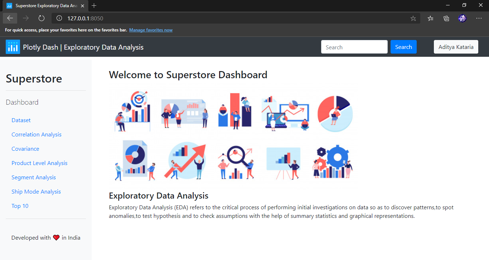

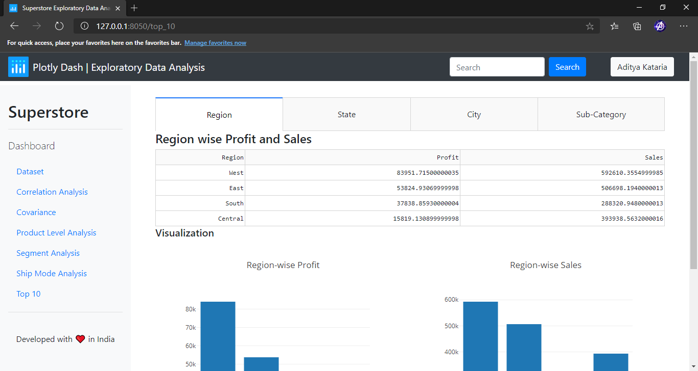

## References
1. https://pandas.pydata.org/
2. https://matplotlib.org/
3. https://seaborn.pydata.org/
4. https://plotly.com/dash/
